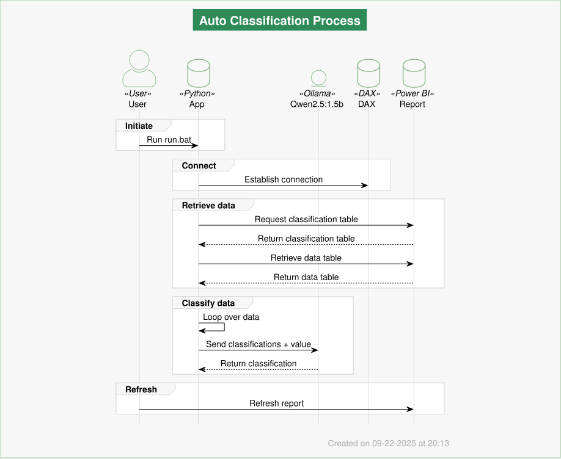
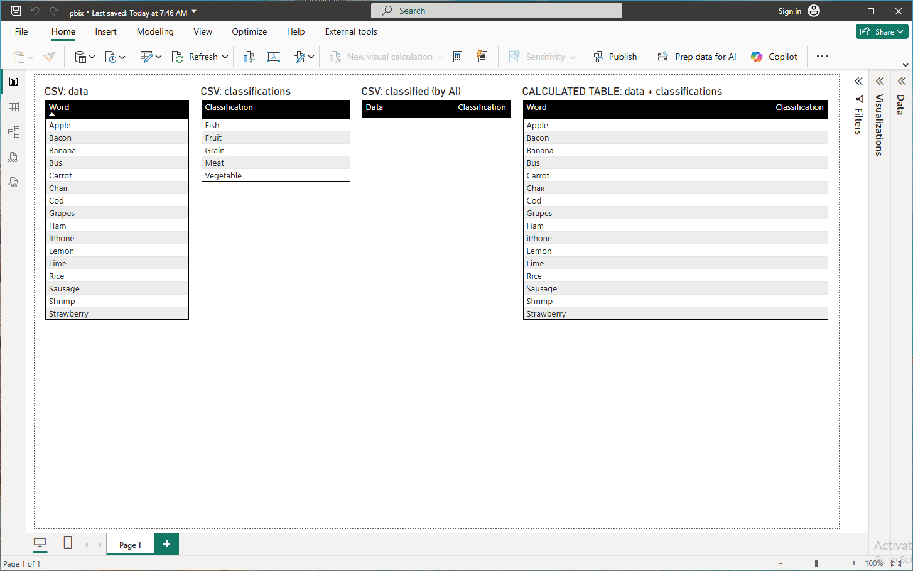
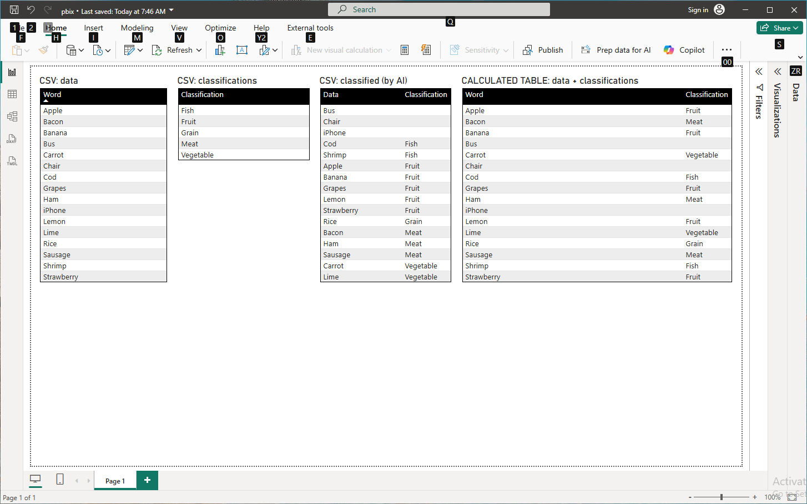

# Auto Classification of PBIX data

This tool allows you to automatically classify your PBIX data using Ollama.

## How to run classification

__Steps__

1. Open `pbix.pbix` in Power BI Desktop
    - Only one report can be open at a time
2. Update `parameters.json` where necessary
3. Run `run.bat` to generate `classified.csv`
4. Refresh report in Power BI Desktop

__Requirements__

- Python
- Ollama
- Power BI Desktop
- DAX Studio

__Parameters__

`parameters.json`

| Property | Value | Description |
| :- | :- | :- |
| output | output | Output directory |
| model | qwen2.5:1.5b | Model to use |
| sources.classification.table | classifications | Table name for classification |
| sources.classification.column | Classification | Column name for classification |
| sources.data.table | data | Table name for data |
| sources.data.column | Word | Column name for data |

## How to update diagram

__Steps__

1. Run `draw.bat` to update `diagram.svg`

__Requirements__

- Java

## How it looks

These images show how the CSV `classified.csv` changes after running `run.bat` and refreshing the report in Power BI Desktop. The "calculated table" is a mapping between the data CSV and classifications CSV through the classified CSV file.

_Power BI Desktop: Before running classification_

_Power BI Desktop: After running classification and refresh_